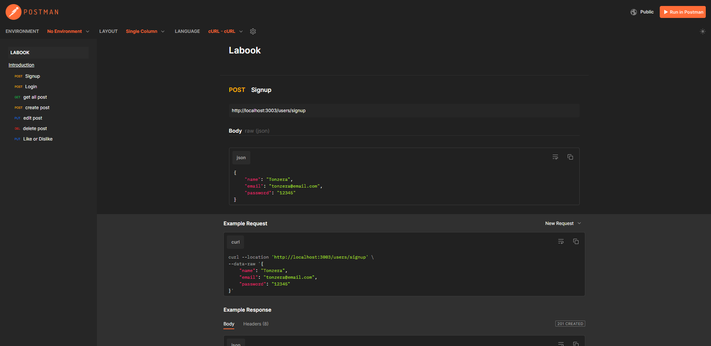

# **Projeto Labook**
O Labook é uma rede social com o objetivo de promover a conexão e interação entre pessoas. Quem se cadastrar no aplicativo poderá criar e curtir publicações.

Agora que temos as bases de criação de APIs e banco de dados, o próximo nível é a implementação de segurança e códigos mais escaláveis. Veremos durante o prazo de entrega desse projeto inúmeros conceitos e formas de desenvolvimento seguindo padrões de design e arquitetura, e seu desafio será unir as funcionalidades com as boas práticas de código.

## ⚒️ Índice
- <a href="#-tecnologias-utilizadas">Tecnologias Utilizadas</a>
- <a href="#-funcionalidades-do-projeto">Funcionalidades do Projeto</a>
- <a href="#-banco-de-dados">Banco de dados</a>
- <a href="#-layout">Layout</a>
- <a href="#-demonstracao">Demonstração</a>
- <a href="#-Autor">Autor</a>

## Tecnologias Utilizadas
- NodeJS
- Typescript
- Express
- SQL e SQLite
- Knex
- POO
- Arquitetura em camadas
- Geração de UUID
- Geração de hashes
- Autenticação e autorização
- Roteamento
- Postman

## 📱 Funcionalidades do Projeto
- [x] Cadastrar usuário
- [x] Fazer login
- [x] Criar post
- [x] Editar post
- [x] Deletar post 
- [x] Visualizar posts e seus criadores 
- [x] Dar like ou dislike 

## Banco de dados

https://dbdiagram.io/d/63d16443296d97641d7c1ae1

## 🖥️ Layout

## Demonstração
[Link de Demonstração do Postman](https://documenter.getpostman.com/view/24823077/2s93mBxeu2)

## Autor

[Linkedin](https://www.linkedin.com/in/ton-mello/)
